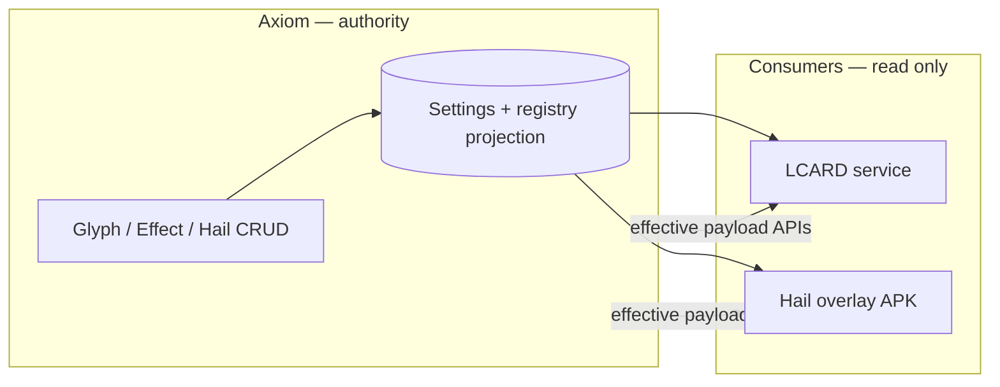

# Hails authority v002

**Status:** Active — graduated at **Hails Collective Beta 2.0** (`hails-2.0-beta`, 2026-06-17). Supersedes the v001 doc for new work; v001 remains historical.
**Collective authority:** `docs/hails/hails-collective-beta-v002.md`
**Terminology:** `docs/hails/NAMING.md` (Praxis: `doctrine-hail-platform-naming`).  
**Applies to:** `ctrl-alt-axiom`, `control-alt-lcard`, Hail overlay APK, and any future consumer.

## Summary

**Axiom is the authority** for Glyphs, Effects, and Hails. Operators create, update, and retire fleet objects through Axiom (Hails studio, Hail Forge, composer APIs, settings persistence). Nothing is fleet-canonical because it ships in a bundled JSON file or because a downstream app cached it yesterday.

The **glyph registry** (and analogous effect catalog storage) is **downstream persistence and projection**: Axiom decides, then instructs what to store and expose. If Axiom has zero glyphs, consumers must see zero glyphs — not a baked-in allowlist.

**LCARD** and the **Hail APK** are **runtime consumers**. They fetch effective Hail construction from Axiom, send or render it, and do not maintain parallel authoritative catalogs.

## Authority flows

| Layer | Role | Must |
| --- | --- | --- |
| **Axiom** | Authority + operator CRUD | Own glyph/effect/hail records; validate against standards contracts; publish effective payloads |
| **Registry storage** | Persist what Axiom instructs | Reflect Axiom CRUD; empty when Axiom says empty |
| **LCARD** | Send Hails to rooms | Consume Axiom directly (`GET /api/effective/lcard`, hail send/bootstrap APIs); no fleet glyph/effect SoT |
| **Hail APK** | Display constructed Hail on device | Consume Axiom/LCARD-delivered render payload; no independent glyph catalog SoT |

## Axiom CRUD (authority surfaces)

| Object | Operator surfaces | Persistence (instructed by Axiom) |
| --- | --- | --- |
| **Glyphs** | Hail Forge glyph workspace, glyph workbench promote path, composer glyph APIs | Settings-backed glyph specs + registry projection |
| **Effects** | Hail Forge effect workspace, effect preset APIs | Gallery baselines + `custom_effect_presets` / overrides in settings |
| **Hails** | Hails studio, New Hail dialog | Domain `hails` in settings (`hails_catalog_materialized`) |

**Direction of truth:** operator action in Axiom → validate → persist → expose on `GET /api/hails`, `GET /api/hails/{id}/render-payload`, `GET /api/effective/{app_id}`, and registry summaries.

**Not authoritative:** shipped `config/hails/glyph-registry.v001.json` entries that Axiom has not adopted; LCARD `app_settings` hail lists used only as migration/legacy seed until domain materialization; APK drawable packs except as render-time assets resolved from Axiom-published glyph identity.

## Registry (storage, not dictation)

The glyph registry artifact (`config/hails/glyph-registry.v001.json`, `backend/glyph_registry.py`) exists to **store and validate** glyph identity metadata that **Axiom has placed into the fleet** — schemas, statuses, selector metadata, future asset refs.

It does **not** get to pre-populate the operator fleet. In the target model:

- `known_glyphs` / `glyph_catalog` on `GET /api/hails` enumerate **only** glyphs Axiom owns (settings + promoted registry rows Axiom wrote).
- Glyph CRUD in Forge/workbench **writes** registry state; consumers **read** it.
- Empty Axiom glyph library → empty `known_glyphs`, empty Forge glyph list, empty selector catalog.

See `docs/hails/glyph-registry-v001.md` for schema and API; see **Implementation alignment** below for current gaps.

## Axiom → LCARD

LCARD sends Hails using payloads **sourced from Axiom**:

| Need | Axiom source |
| --- | --- |
| Hail definitions / catalog | `GET /api/effective/lcard` (and/or domain hails materialized into effective payload) |
| Render contract | `GET /api/hails/render-contract` |
| Per-hail consumer payload | `GET /api/hails/{id}/render-payload` or equivalent merge at send time |
| Glyph / effect identity | Carried in render payload — not LCARD-local allowlists as SoT |

LCARD may cache for performance (e.g. short TTL on bootstrap). Cache is **non-authoritative** and must reconcile to Axiom.

LCARD must **not** PATCH fleet hails or glyphs as source of truth. Send path validates against Axiom-published allowlists derived from Axiom storage, not static repo JSON alone.

**Repo:** `control-alt-lcard` — `service/lib/axiom-hail-render-payload-adapter.js`, `service/lib/hail-overlay-payload.js`, hail overlay bootstrap routes.

## Axiom → Hail APK

The Hail overlay APK displays the **constructed Hail** on screen from the delivery payload chain:

1. Axiom defines hail + visual + glyph + effect construction.
2. LCARD (or test harness) delivers overlay POST with consumer render payload aligned to Axiom contract.
3. APK resolves glyph drawables / procedural hints **from that payload**, not from a static fleet catalog baked into the APK as SoT.

APK asset packs (drawables) are **render assets** keyed by glyph identity Axiom publishes. When Axiom introduces a new glyph, Axiom + promote/sync paths instruct what the APK needs; the APK does not define what glyphs exist in the fleet.

**Repo:** `control-alt-lcard/hail-overlay-poc/` (Android renderer, overlay contract).

## Related APIs (Axiom)

| Method | Path | Purpose |
| --- | --- | --- |
| `GET` | `/api/hails` | Fleet hails + glyph/effect catalogs (must reflect Axiom authority) |
| `GET` | `/api/hails/{id}/render-payload` | Consumer-ready constructed hail |
| `GET` | `/api/hails/render-contract` | Shared visual contract |
| `GET` | `/api/effective/lcard` | LCARD bootstrap (hails, settings merge) |
| `POST` | `/api/hails/composer/register-glyph` | Create glyph (authority write) |
| `PATCH` | `/api/hails/composer/custom-glyphs/{id}` | Update/archive glyph |
| `POST` / `PUT` / `DELETE` | `/api/hails/composer/effect-presets/...` | Effect preset CRUD |

## Implementation alignment (honest current state)

Code is **migrating** toward this contract. Known gaps as of v001 authority doc:

| Area | Target | Current drift |
| --- | --- | --- |
| Glyph allowlist | Settings-only glyphs Axiom owns | Bundled `glyph-registry.v001.json` still seeds `known_glyphs` via `effective_hail_glyph_allowlist()` |
| Forge library | Only Axiom-authored glyphs | Built-in registry tiles removed from Forge UI; API may still list registry ids until backend alignment |
| LCARD | Axiom-only bootstrap | Legacy `app_settings.lcard.hails` seed path until fully materialized |
| APK | Payload-driven display | Some registry/contract tiers still documented as static references — render path must stay payload-led |

Agents and implementers: **do not add new features that treat bundled registry JSON or LCARD-local lists as fleet authority.** New work should move CRUD and catalogs toward Axiom settings + instructed registry projection.

## Related documents

| Document | Role |
| --- | --- |
| `docs/hails-v001-integration.md` | LCARD integration boundary (companion) |
| `docs/hails/glyph-registry-v001.md` | Registry schema and storage shape |
| `docs/hails/hail-forge-v001.md` | Forge authoring UX |
| `docs/hails/custom-glyph-library-v001.md` | My Glyphs composer storage |
| `docs/hails/glyph-composition-direction-v001.md` | **Locked** Glyph generation direction (H3 target; supersedes H2) |
| `docs/hails/hails-render-parity-v001.md` | **Locked** Paintbox ↔ Google TV parity + render layers |
| `docs/hails/glyph-hero-intent-v001.md` | Operator-facing Hero Glyph doctrine |
| `docs/hails/effect-registry-v001.md` | Effect registry (parallel pattern) |
| `docs/hails/consumer-surface-matrix-v001.md` | Per-surface capability matrix |

## Beta cut addendum

- Registry glyphs deprecated for compose; custom procedural primary path

